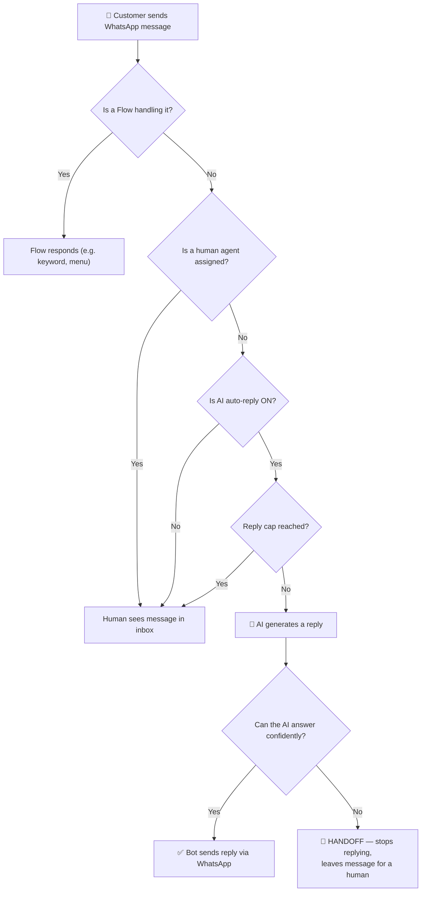

# 🤖 AI Agent Feature — What It Does & Real-Life Example

## What Is the AI Agent?

The AI Agent is a **bring-your-own-key** AI assistant built into your WhatsApp CRM. It uses **your own** OpenAI or Anthropic API key to power three things:

| Capability | Where It Shows Up | How It Triggers |
|---|---|---|
| **Draft with AI** | Inbox — a button next to the reply box | An agent clicks the button to get a suggested reply |
| **Auto-Reply Bot** | Runs automatically in the background | Fires when a new WhatsApp message arrives and no human agent is assigned |
| **Playground** | AI Agents → Playground tab | You type test messages to see how the bot would respond |

---

## How It Works Behind the Scenes



### Key Safety Guardrails

1. **Handoff to humans** — If the AI is unsure, the customer is upset, or they ask for a human, it emits a `[[HANDOFF]]` signal, stops auto-replying on that thread, and surfaces it to your team.
2. **Reply cap** — You set a max number of AI replies per conversation (default: 3). After that, it goes quiet and waits for a human.
3. **Knowledge base grounding** — The AI searches your uploaded business docs (FAQ, pricing, policies) before answering, so it doesn't hallucinate facts.
4. **Flows win** — If you have an automation/flow set up for a keyword, that runs first — the AI never double-texts.

---

## 🏪 Real-Life Example: "Brew & Bean" Coffee Equipment Store

Imagine you run **Brew & Bean**, a small business that sells espresso machines and accessories on WhatsApp.

### Step 1 — Setup (one-time)

You go to **AI Agents → Setup** and configure:

| Setting | Value |
|---|---|
| Provider | OpenAI |
| Model | gpt-5.4-mini |
| API Key | `sk-...` (your own key) |
| Business Context | *"We are Brew & Bean, a coffee-equipment store. Be warm and concise. We offer free shipping on orders over ₹5,000. Our return policy is 7 days. Never quote exact delivery dates — hand off to a human for those."* |
| Enable AI assistant | ✅ ON |
| Auto-reply | ✅ ON |
| Max replies per conversation | 3 |

You also upload a **Knowledge Base** document with your product catalog and FAQ.

### Step 2 — A Real Customer Conversation

Here's what happens when a customer messages you on WhatsApp at 11 PM (when your team is offline):

---

````carousel
### 💬 Turn 1 — Customer asks a question

**Customer (WhatsApp):**
> "Hi! Do you have the Breville Barista Express in stock?"

**What happens:**
1. Message arrives at the webhook
2. No flow matches → No human assigned → AI auto-reply is ON → reply count is 0/3
3. AI searches your knowledge base → finds "Breville Barista Express — ₹42,999 — In Stock"
4. AI generates and sends:

**AI Bot (WhatsApp):**
> "Hey! 👋 Yes, the Breville Barista Express is in stock — it's ₹42,999. Would you like to place an order?"

*Reply count: 1/3*
<!-- slide -->
### 💬 Turn 2 — Follow-up question

**Customer:**
> "Nice! And do you have the wooden tamper that goes with it?"

**AI Bot:**
> "We do! The Acacia Wood Tamper is ₹1,499 and pairs perfectly with the Barista Express. Your total would be over ₹5,000, so you'd get free shipping too! 🎉"

*Reply count: 2/3*
<!-- slide -->
### 💬 Turn 3 — Question the AI can't answer

**Customer:**
> "Great, I'll take both. When will it arrive? I need it by Friday."

**What happens:**
- AI sees a delivery-date question
- Your business context says *"Never quote exact delivery dates — hand off to a human"*
- AI emits `[[HANDOFF]]`
- Bot goes **silent** — no reply sent
- The conversation appears in your team's inbox as **unassigned + needs attention**

*Auto-reply disabled for this thread* ⛔
<!-- slide -->
### 💬 Turn 4 — Human takes over next morning

Your support agent **Priya** opens the inbox at 9 AM, sees the conversation, and assigns herself:

**Priya (WhatsApp):**
> "Hi! Thanks for your order 😊 We can definitely get it to you by Friday — I'll process this right now. I'll send you a payment link in a moment!"

*The AI stays quiet for the rest of this thread because it handed off.*
````

---

### What the Playground Looks Like

Before going live, you would have tested this in the **Playground** tab — typing customer messages yourself to see how the bot responds and verifying the handoff works:

| You type (as customer) | Bot replies |
|---|---|
| "Do you sell grinders?" | "Yes! We have the Baratza Encore at ₹15,999 and the Timemore C2 at ₹3,499. Which one interests you?" |
| "I want to complain, this is broken" | *(no text)* — ⚠️ **Would hand off to a human here** |
| "Let me talk to a person" | *(no text)* — ⚠️ **Would hand off to a human here** |

---

## Summary

> [!TIP]
> The AI Agent is like hiring a **smart, 24/7 junior support agent** who knows your product catalog, follows your rules, and is smart enough to say *"I should let a human handle this"* when things get tricky — all running on your own API key with zero per-seat AI fees.

| Feature | What it does |
|---|---|
| **Auto-Reply** | Answers customers automatically when your team is offline or busy |
| **Draft with AI** | Suggests replies to agents in the inbox — they review and send |
| **Playground** | Sandbox to test the bot before turning it on for real customers |
| **Knowledge Base** | Grounds answers in your own docs so the AI doesn't make things up |
| **Handoff** | Automatically stops and escalates to a human when unsure |
| **Reply Cap** | Limits how many times the bot replies in one thread |
